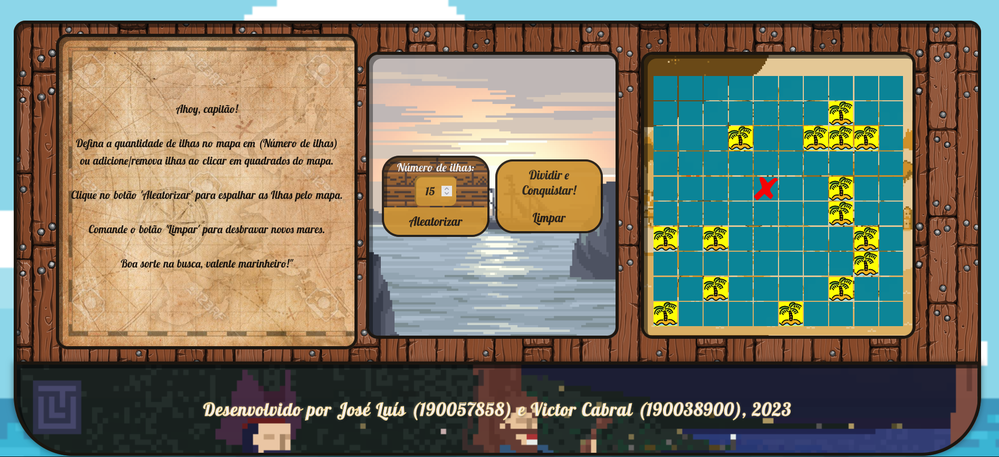
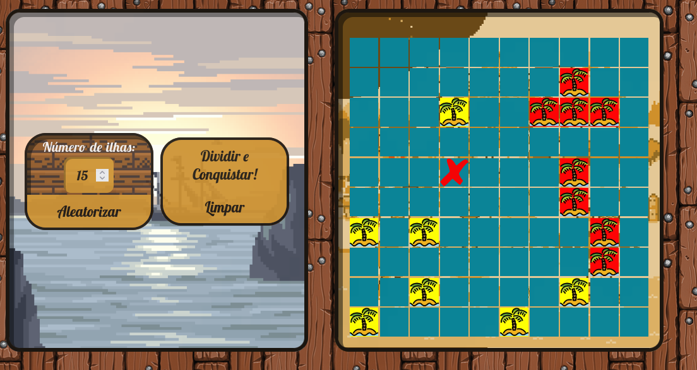
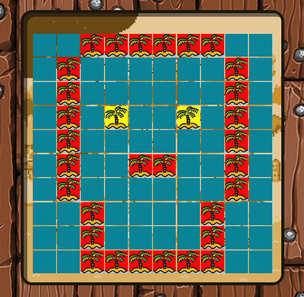
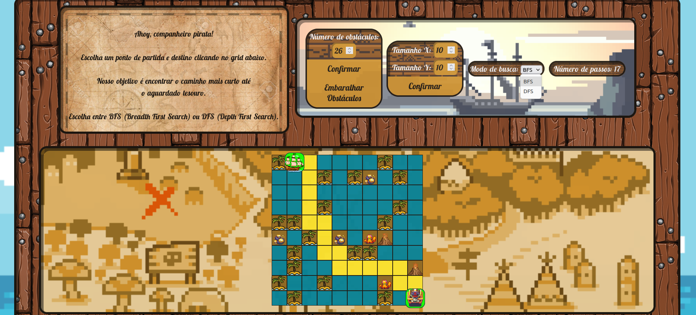
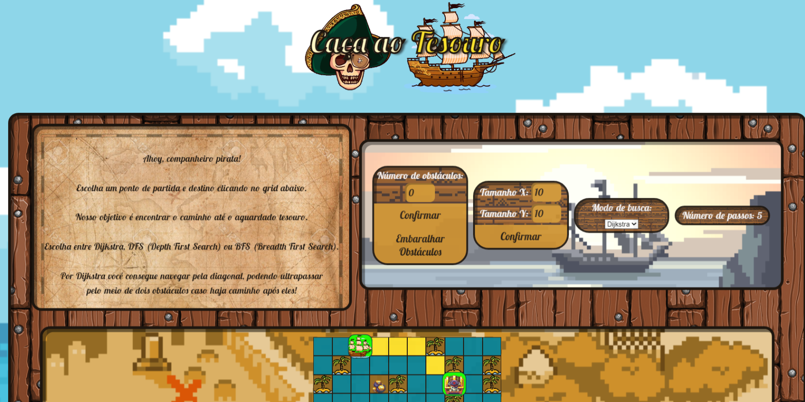
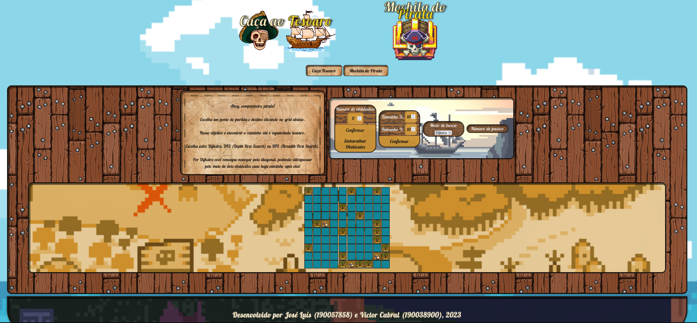

# Ilhas Vizinhas

**Número da Lista**: 37 
**Conteúdo da Disciplina**: Dividir e Conquistar 

## Alunos
|Matrícula | Aluno |
| -- | -- |
| 19/0057858  |  José Luís Ramos Teixeira |
| 19/0038900  |  Victor de Souza Cabral |

## Sobre 
As "Ilhas Vizinhas" é um projeto que utiliza o algoritmo de "Dividir e Conquistar". Neste jogo, você embarcará em uma aventura pirata, explorando um mapa cheio de ilhas misteriosas.

O objetivo principal é encontrar as ilhas mais próximas umas das outras, utilizando o algoritmo de "Dividir e Conquistar". O algoritmo divide o mapa em regiões menores, conquistando cada uma delas de forma eficiente e combinando os resultados para encontrar as ilhas vizinhas mais próximas.

## Screenshots

## Vídeo de Apresentação (Dividir e Conquistar)

**Conteúdo:** Dividir e Conquistar.

Vídeo contendo explicação das modificações feitas para a entrega da unidade 4. Foco em apresentar as novidades implementadas. 

(Para melhor contexto do projeto em geral assistir os vídeos de apresentação complementar).

## Vídeo de Apresentação Complementar (Grafos 1, Grafos 2 e Knapsack)

Vídeos complementares contendo explicação da entrega feita para a unidade 1, 2 e 3. 

**Conteúdo:** Depth First Search (DFS) ou Breadth First Search (BFS)

**Conteúdo:** Dijkstra.

**Conteúdo:** Knapsack.

## Instalação 
**Linguagem**: HTML, CSS e JavaScript 
**Framework**: Não há necessidade de instalar nenhum framework. Para rodar o projeto, basta clonar o repositório e abrir o arquivo index.html no navegador ou acessar o link. 

## Uso 
**Acessar o link:** <https://projeto-de-algoritmos.github.io/DC_IlhasVizinhas/>

Para começar a sua jornada, você terá controle sobre a quantidade de ilhas destacadas. Clicando no botão "Aleatorizar", as Ilhas serão espalhados pelo mapa, aumentando a emoção da busca. Em seguida, basta acionar o botão "Dividir e Conquistar" para encontrar as ilhas mais próximas umas das outras. Se desejar explorar novos mares, clique no botão "Limpar" e inicie uma nova busca em um mapa em branco.

## Outros 
Este projeto foi criado como parte do curso de Projeto de Algoritmos da Faculdade do Gama - Universidade de Brasília (FGA-UnB). Qualquer sugestão ou contribuição é bem-vinda.

